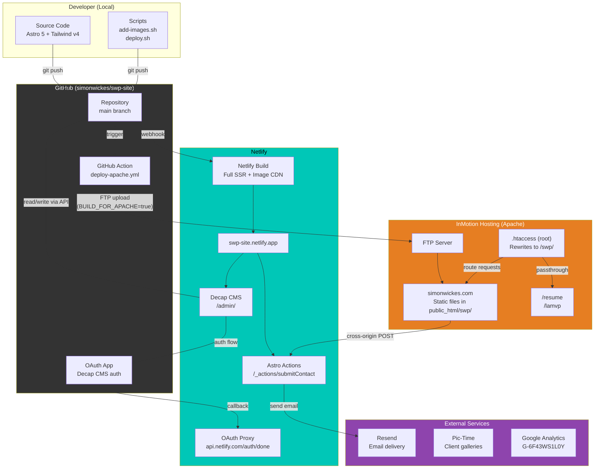
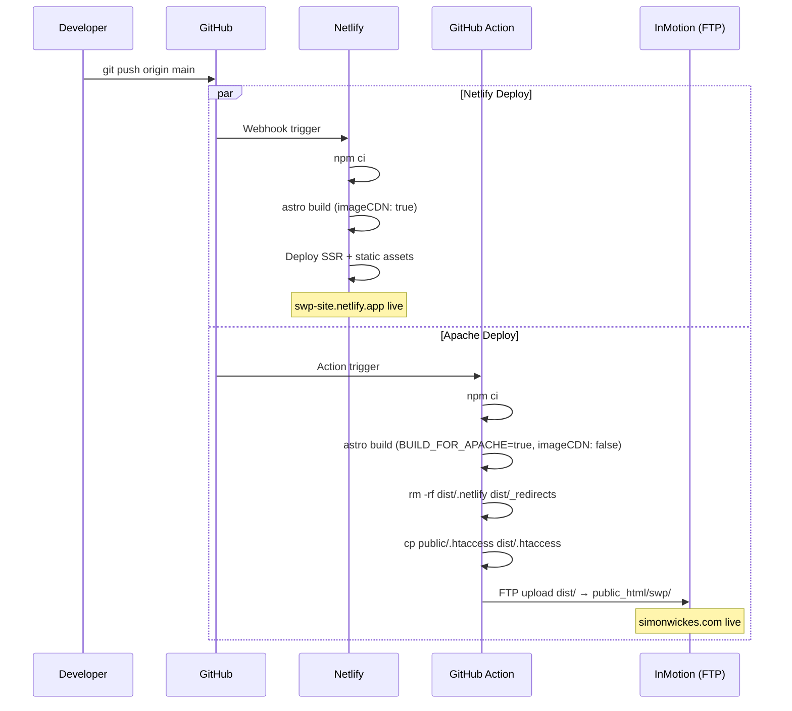
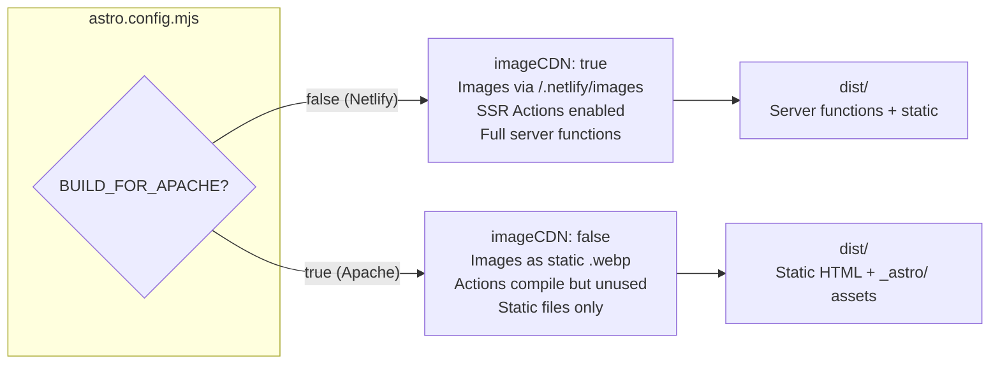
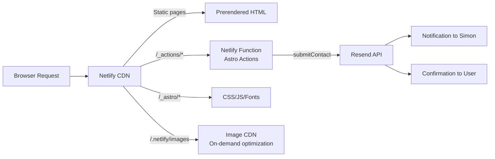
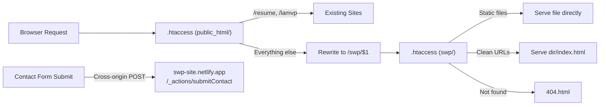
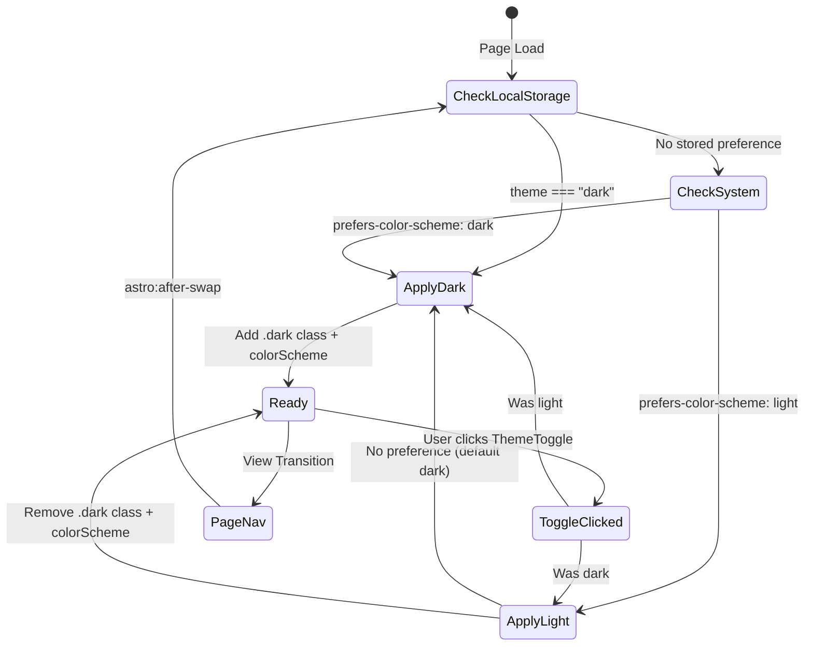
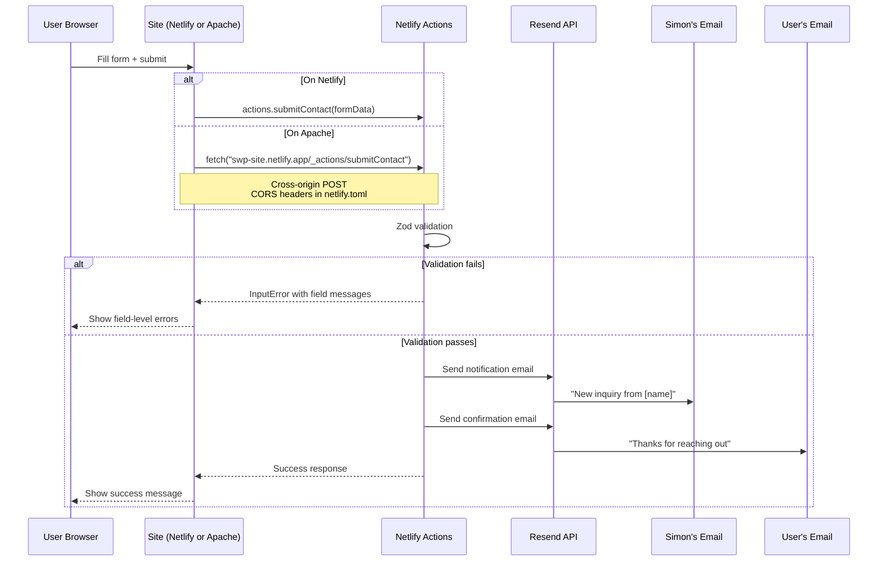
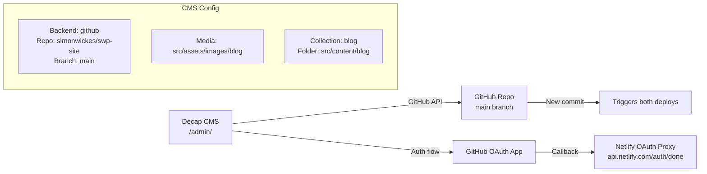
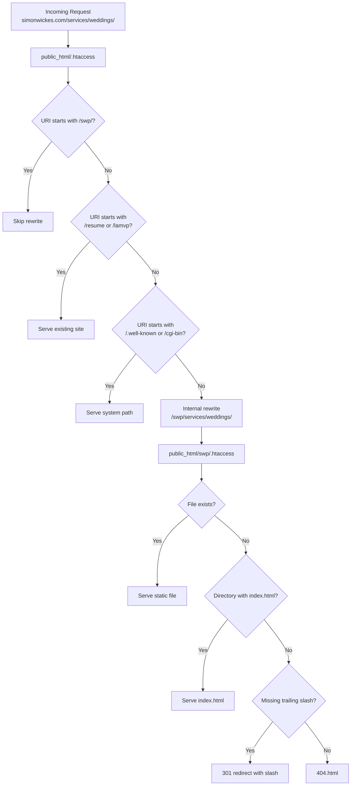

# Site Architecture

Developer-level documentation of the simonwickes.com photography site.

---

## System Overview



---

## Deployment Pipeline



---

## Build Variants

The site builds differently for each target:



---

## Request Flow

### Netlify (swp-site.netlify.app)



### Apache (simonwickes.com)



---

## Tech Stack

### Core Framework

| Component | Technology | Version |
|-----------|-----------|---------|
| Framework | Astro | 5.17.1 |
| CSS | Tailwind CSS (v4, CSS-first) | 4.1.18 |
| Adapter | @astrojs/netlify | latest |
| Content | Astro Content Collections (glob loader) | built-in |
| TypeScript | Strict mode | built-in |

### Client-Side Libraries

| Library | Purpose | Version |
|---------|---------|---------|
| Swiper | Hero carousel | 12.1.0 |
| PhotoSwipe | Lightbox for service galleries | 5.4.4 |
| Fuse.js | Client-side blog search | 7.1.0 |
| astro-masonry | Masonry grid layout | 1.2.2 |
| date-fns | Date formatting | 4.1.0 |

### Fonts

| Font | Usage | Variable |
|------|-------|----------|
| Plus Jakarta Sans | Body text | `--font-body` |
| Nunito | Display/headings | `--font-display` |

---

## Content Architecture

### Blog Posts

**Location:** `src/content/blog/*.md`

**Schema** (defined in `src/content.config.ts`):

| Field | Type | Required | Notes |
|-------|------|----------|-------|
| title | string | yes | |
| date | date | yes | Coerced from YYYY-MM-DD |
| category | string | yes | Must match a service slug |
| tags | string[] | no | |
| featuredImage | image() | no | Astro typed image reference |
| featuredImageAlt | string | no | |
| galleryUrl | URL | no | Pic-Time session link |
| author | string | yes | Default: "simon" |

### Service Categories

Defined in `src/data/services.ts`. Each service has a slug, title, description, and a corresponding:
- Page at `src/pages/services/<slug>.astro`
- Image folder at `src/assets/images/services/<slug>/`
- Decap CMS category option in `public/admin/config.yml`

| Slug | Title |
|------|-------|
| outdoor-portraits | Outdoor Portraits |
| weddings | Weddings |
| commercial | Commercial |
| landscape | Landscape |
| cars | Cars |
| assignments | Assignments |
| events | Events |
| live-performances | Live Performances |

### Image Organization

```
src/assets/images/
├── hero/              # 4 carousel slides (slide-1 through slide-4)
├── featured/          # Homepage grid (named by category)
├── services/
│   ├── outdoor-portraits/   # Numbered 01.jpg, 02.jpg, ...
│   ├── weddings/
│   ├── commercial/
│   ├── landscape/
│   ├── cars/
│   ├── assignments/
│   ├── events/
│   └── live-performances/
├── blog/              # CMS-uploaded post images
└── test/              # Test images
```

**Image Loading Pattern** (service pages):
```typescript
const imageModules = import.meta.glob<{ default: ImageMetadata }>(
  "/src/assets/images/services/<slug>/*.{jpg,jpeg,png,webp}",
  { eager: true }
);
const images = Object.entries(imageModules)
  .sort(([a], [b]) => a.localeCompare(b))
  .map(([path, mod]) => ({ src: mod.default, alt: "..." }));
```

---

## Layout Hierarchy

```mermaid
graph TD
    BASE["BaseLayout.astro<br/>HTML shell, meta, theme init,<br/>analytics, View Transitions"] --> PAGE["PageLayout.astro<br/>Header (persist), main (fade), Footer (persist)"]
    PAGE --> CONTENT["Page Content<br/>(slots)"]

    BASE -.->|"ClientRouter"| VT[View Transitions]
    BASE -.->|"inline script"| THEME[Theme Initialization]
    PAGE -.->|"transition:persist"| HEADER[Header + ThemeToggle]
    PAGE -.->|"transition:persist"| FOOTER[Footer]
    PAGE -.->|"transition:animate=fade"| MAIN[Main Content]
```



---

## Dark Mode System



**Implementation details:**
- Class-based: `.dark` on `<html>` element
- Tailwind v4 custom variant: `@custom-variant dark (&:where(.dark, .dark *))`
- Inline script in `<head>` prevents flash of wrong theme
- `astro:after-swap` re-applies theme during View Transitions
- Smooth transitions enabled after initial paint via `.theme-ready` class

---

## Contact Form Flow



**CORS Configuration** (`netlify.toml`):
```toml
[[headers]]
  for = "/_actions/*"
  [headers.values]
    Access-Control-Allow-Origin = "https://simonwickes.com"
    Access-Control-Allow-Methods = "POST, OPTIONS"
    Access-Control-Allow-Headers = "Content-Type"
```

---

## CMS Architecture



**Config:** `public/admin/config.yml`

---

## Apache Routing (InMotion)



---

## Key Configuration Files

| File | Purpose |
|------|---------|
| `astro.config.mjs` | Astro config: adapter, sitemap, env schema, Tailwind |
| `src/styles/global.css` | Tailwind v4 theme: colors, fonts, custom variants |
| `src/content.config.ts` | Blog collection schema (Zod) |
| `src/data/services.ts` | Service definitions (slug, title, description) |
| `src/data/gallery.ts` | Pic-Time gallery URL |
| `public/admin/config.yml` | Decap CMS backend, media, collection fields |
| `public/.htaccess` | Apache config for swp/ subfolder (clean URLs, caching) |
| `scripts/htaccess-public_html.txt` | Template for InMotion root .htaccess |
| `netlify.toml` | CORS headers for cross-origin contact form |
| `.github/workflows/deploy-apache.yml` | GitHub Action: build + FTP to InMotion |
| `scripts/deploy.sh` | One-command deploy (pull, stage, commit, push) |
| `scripts/add-images.sh` | Image management (replace gallery/hero/featured) |

---

## API Endpoints

| Endpoint | Type | Purpose |
|----------|------|---------|
| `/api/posts.json` | GET (prerendered) | Blog search data (id, title, category, tags, excerpt) |
| `/_actions/submitContact` | POST (SSR) | Contact form submission (Netlify only) |
